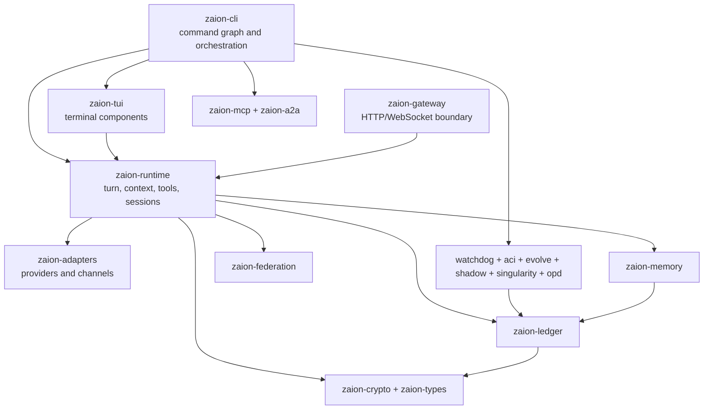

# Zaion Project Map

Status: canonical navigation map  
Last audited: 2026-07-15  
Workspace: `D:/zaion-rust`

This document explains where Zaion behavior lives. It is intentionally more
stable than the progress ledgers. For the current health snapshot and known
breakages, read [PROJECT_STATUS.md](PROJECT_STATUS.md).

## Product entry points

| User action | Current implementation | Primary source |
| --- | --- | --- |
| `zaion` | Opens the chat-first ratatui application when identity, provider, stdin TTY, and stdout TTY are ready; otherwise prints a neural status snapshot | `crates/zaion-cli/src/commands/launcher.rs`, `crates/zaion-cli/src/commands/process/tui/mod.rs` |
| `zaion tui` | Enters the same authoritative terminal TUI/snapshot gate explicitly | `crates/zaion-cli/src/commands/process/tui/` |
| `zaion dashboard` | Starts/checks the local gateway and opens `/ui` | `crates/zaion-cli/src/commands/hub.rs`, `crates/zaion-cli/src/commands/network/console.rs` |
| `zaion start` | Starts the full background runtime and channels | `crates/zaion-cli/src/commands/network/` |
| `zaion gateway start` | Starts the lower-level HTTP gateway only | `crates/zaion-cli/src/commands/gateway.rs` |
| `zaion chat` / `zaion wake` | Runs a provider-backed turn | `crates/zaion-cli/src/commands/process/` |

Packaged services use the internal foreground form `zaion _daemon_run` so the
service manager owns process lifetime; interactive users should use
`zaion start`.

The browser dashboard is embedded in the Rust product. The former standalone
public website was intentionally retired on 2026-07-13.

## Repository layout

| Path | Purpose | Change rule |
| --- | --- | --- |
| `crates/` | Rust workspace: 36 crates | Business logic and product surfaces |
| `docs/` | User, operator, architecture, and historical documentation | Current facts must be linked from `docs/README.md` |
| `plans/` | Active ledgers, contracts, evidence, and historical blueprints | Plans are not implementation proof |
| `.github/workflows/` | CI, release, and container automation | Must agree with files that actually exist |
| `scripts/` | Repository and release checks | Checks must be read-only unless explicitly named otherwise |
| `test-skills/` | Skill execution fixtures | Test-only content |
| `zaion-data/` | Local identity, ledger, and runtime data | Ignored; never bulk-delete during cleanup |
| `target/` | Cargo build output | Reproducible and ignored |
| `.claude/worktrees/` | Registered auxiliary Git worktrees | Treat as independent dirty worktrees, not cache folders |

## Runtime collaboration model



The diagram shows the intended product flow, but the current dependency graph
is more coupled: `zaion-cli` directly depends on 30 workspace crates and is the
main integration hub.

The CLI TUI entry is now selected: `process/tui/mod.rs::cmd_tui` is the single
gate and ready terminals call `process/tui/app.rs::run_tui_app`. Non-ready or
non-interactive invocations remain mutation-free snapshots. Ownership is still
split between the CLI application and reusable `zaion-tui` components, so the
crate boundary and remaining unselected `zaion-tui` generations still need
consolidation.

Wake ingress and stream protocol types now live in
`zaion-runtime/src/wake_request.rs` and `zaion-runtime/src/wake_stream.rs`.
`WakeFeaturePolicy` in the request module is the single effective-policy
boundary for memory, MCP, compression, webhooks, cache, and smart-route.
Default and unified execution consume that resolved policy; chat, TUI, launcher,
HTTP, Telegram, MCP, and ACP adapters only express request overrides and surface
defaults. Internal service ingress inherits config-driven automatic compression
instead of marking it as explicitly requested. Explicit compression uses the
runtime forced compressor and split path below the configured threshold; its
provider-summary preview uses the same forced middle-selection inputs, while
fully protected histories remain truthful no-ops. Explicit disable flags still
win, and signed evidence records the requested and actual outcome separately.
Typed execution lives in `turn_kernel.rs`; canonical terminal outcomes and
verified proof closure live in `turn_outcome.rs`; `evidence_graph.rs` and
`turn_proof.rs` bind answer evidence and signed lineage. Default and unified
successful wake paths construct these runtime-owned results, including an
explicit signed transition when compression moves output from a parent to child
session namespace. `zaion-cli::commands::process` still re-exports compatibility
types, surface callers still flatten terminal results, and active provider/tool/
ledger choreography remains in CLI `process/wake.rs`. The result boundary is
established, but the real turn-kernel migration is not complete.

The two current CLI HTTP server loops now share a G0 gateway contract for
loopback-by-default binding, environment/CLI overrides, and strong `/health`
identity. They are not yet one server implementation, and `zaion-gateway`
remains outside the production CLI dependency graph.

## Crate groups

### Foundations and trust

- `zaion-paths`: canonical local paths.
- `zaion-types`: shared identifiers, events, policies, and envelopes.
- `zaion-crypto`: Ed25519 identity and signing.
- `zaion-ledger`: append-only signed event and session storage.
- `zaion-secrets`: encrypted secret storage and audit.
- `zaion-safety`: redaction and prompt-injection checks.
- `zaion-pricing`: model usage and cost normalization.

### Runtime and state

- `zaion-runtime`: agent loop, context, compression, tools, sessions, batch,
  operation stream, typed turn execution, evidence graphs, and proof closure.
- `zaion-memory`: typed, semantic, projection, and principal memory.
- `zaion-core`: process lifecycle and local controller state.
- `zaion-checkpoint`, `zaion-gitledger`, `zaion-sync`: snapshots, rollback, and
  event synchronization.
- `zaion-telemetry`: standalone telemetry primitives; currently has no
  workspace consumer.

### Surfaces and integration

- `zaion-cli`: executable command graph and much of the current orchestration.
- `zaion-tui`: reusable terminal rendering and component library.
- `zaion-adapters`: provider and channel adapters.
- `zaion-gateway`: HTTP/WebSocket boundary; currently a leaf crate outside the
  CLI dependency graph.
- `zaion-mcp`, `zaion-a2a`, `zaion-federation`: tool and agent interoperability.
- `zaion-codex`: code indexing and code-intelligence helpers.

### Autonomy and evolution

- `zaion-watchdog`: Ouroboros monitoring and repair history.
- `zaion-aci`: gated file, command, and AST actions.
- `zaion-evolve`: scan, propose, review, promote, and record changes.
- `zaion-shadow`: isolated/parallel task execution.
- `zaion-ego`, `zaion-autonomic`, `zaion-proprioception`, `zaion-metabolic`,
  `zaion-curiosity`, `zaion-singularity`: Systems I-V and their orchestrator.
- `zaion-opd`: trajectory and optimization experiments; currently has no
  workspace consumer.
- `zaion-enclave`: software enclave and attestation experiments.
- `zaion-proptest`, `zaion-contract-macros`: test and contract support.

## Where to make a change

| Change | Start here | Watch for |
| --- | --- | --- |
| Command syntax/help/onboarding | `crates/zaion-cli/src/commands/` | Keep stable, beta, and experimental labels honest |
| Turn request/stream/feature policy | `crates/zaion-runtime/src/wake_request.rs`, `crates/zaion-runtime/src/wake_stream.rs` | Runtime owns request, effective feature policy, and stream types; execution must not re-read raw feature flags |
| Context compression | `crates/zaion-runtime/src/compressor.rs`, `crates/zaion-runtime/src/compression_split.rs`, `crates/zaion-runtime/src/unified_agent_runtime.rs`, CLI `process/wake.rs` and `process_unified.rs` | Keep automatic thresholds distinct from explicit force; summary preview and applied split must select the same middle and preserve honest no-op evidence |
| Typed turn result/proof closure | `crates/zaion-runtime/src/turn_kernel.rs`, `crates/zaion-runtime/src/turn_outcome.rs`, `crates/zaion-runtime/src/evidence_graph.rs`, `crates/zaion-runtime/src/turn_proof.rs` | Keep one canonical closure; bind proof/evidence hashes, signed lineage, receipts, and namespace transitions |
| Turn lifecycle/provider call | `crates/zaion-cli/src/commands/process/wake.rs`, `crates/zaion-runtime/` | Execution is still CLI-owned; avoid duplicating or expanding runtime policy there |
| Terminal layout/rendering | `crates/zaion-cli/src/commands/process/tui/`, `crates/zaion-tui/` | CLI production entry is selected; reusable component ownership and remaining generations still overlap |
| Telegram | `crates/zaion-cli/src/commands/network/telegram.rs`, `crates/zaion-adapters/src/telegram_adapter.rs` | These are the two largest production source files |
| Browser control plane | `crates/zaion-cli/src/commands/network/console.rs` | Authoritative browser surface; standalone website is retired |
| HTTP gateway | `crates/zaion-cli/src/commands/network/gateway_contract.rs`, `crates/zaion-cli/src/commands/network/`, `crates/zaion-gateway/` | G0 bind/identity is shared; server implementation, WebSocket parity, auth, and CORS are not unified |
| MCP/tools | `crates/zaion-mcp/`, `crates/zaion-runtime/src/mcp_tools.rs`, CLI MCP commands | Approval and audit behavior must stay aligned |
| Identity/ledger/proofs | `zaion-types`, `zaion-crypto`, `zaion-ledger`, runtime turn outcome/proof/evidence graph | Preserve signature, lineage, hash, and provenance compatibility |
| Self-healing/evolution | `zaion-watchdog`, `zaion-aci`, `zaion-evolve`, `zaion-opd` | Promotion must remain chain-gated and auditable |

## Documentation contract

- [README.md](../README.md): public product entry and first path.
- [docs/README.md](README.md): documentation index.
- [PROJECT_STATUS.md](PROJECT_STATUS.md): dated health snapshot and blockers.
- [ROADMAP.md](../ROADMAP.md): the only active execution roadmap.
- [CAPABILITY_STATUS.md](CAPABILITY_STATUS.md): stable/beta/experimental surface
  classification.
- [CLI_STABILITY.md](CLI_STABILITY.md): command compatibility contract.
- [plans/README.md](../plans/README.md): plan and evidence taxonomy.
- `MASTER_PLAN.md`, `plans/openclaw_latest_gap_report.md`, and
  `plans/hermes_surpass_master_plan.md`: legacy reverse-chronological evidence
  ledgers, read only when their scope is relevant.

## Verification entry points

```powershell
powershell -ExecutionPolicy Bypass -File scripts/project-audit.ps1
cargo run -p zaion-cli --locked -- architecture-audit --root .
cargo metadata --no-deps --format-version 1 --locked
cargo check --workspace --all-targets --locked
cargo test --workspace --locked -j1 -- --test-threads=1
cargo clippy --workspace --all-targets --locked -- -D warnings
cargo fmt --all -- --check
```

Run the narrowest relevant test first. The full gates are release gates, not a
substitute for targeted regression tests.

## Architectural direction

Project cleanup must preserve Zaion's differentiators: Ed25519 principal
identity, signed append-only evidence, provenance-aware traces, Ouroboros
recovery, ACI/AST-aware actions, chain-gated evolution, and honest observability
labels. Hermes is a polish and breadth reference, not the target architecture.
