# Zaion Architecture Contract

Status: highest priority architecture contract.

This document is the anti-drift contract for ZaionRust. Future planning,
implementation, docs, onboard flows, command surfaces, and maturity claims must
be checked against this architecture before adding new features. If another
document, command, or module conflicts with this contract, this contract wins.

## Core Difference

Zaion is not a Hermes-style multi-channel task runner with more tools. Zaion's
core is a continuous, traceable, identity-stable agentic runtime:

- one Zaion identity across models, channels, devices, and environments
- one canonical envelope for all entrances
- identity and capability preflight before every turn
- signed ledger as the fact source for actions and continuity
- traceable memory/context packs that remain safe for small-context models
- tool permissions and tool receipts for every physical action
- answer trace for every model-facing and user-facing response
- sync/export/import that preserves proof chains
- macro modules promoted only through evidence, tests, docs, and safety gates

## Architecture

```mermaid
graph TD
    subgraph AccessView["Access / View Layer"]
        CLI["CLI"]
        TUI["TUI"]
        IDE["IDE Plugin"]
        API["API Service"]
        MCP["MCP"]
        TG["Telegram"]
        Slack["Slack"]
        Discord["Discord"]
        Feishu["Feishu"]
        DingTalk["DingTalk"]
        WebConsole["Web Console"]
        OtherChannels["Other Channels"]
    end

    subgraph Entrance["Unified Entrance Layer"]
        Envelope["Canonical Envelope"]
        PrincipalRoute["Principal / Session Route"]
        Dedupe["Dedupe + Source Hash"]
    end

    subgraph IdentityCapability["Identity And Capability Layer"]
        Identity["Identity Contract"]
        Continuity["Identity Continuity"]
        Capability["Capability Manifest"]
        PolicyGate["Policy Gate"]
    end

    subgraph LifecycleSafety["Lifecycle And Safety Guard Layer"]
        LifecycleGraph["Lifecycle Graph"]
        ColdStart["Cold Start Contract"]
        Quiescent["Quiescent Contract"]
        NeverManifest["Never Manifest"]
        AnomalyDetector["Anomaly Detector"]
        EscalationEngine["Escalation Engine"]
        Quarantine["Quarantine"]
        Lockdown["Panic-Safe Lockdown"]
    end

    subgraph Runtime["Microkernel Turn Runtime"]
        TurnEnvelope["Runtime Turn Envelope"]
        TurnKernel["Turn Kernel Orchestrator"]
        ContextCompiler["Context Compiler"]
        ContextStrategyRegistry["Context Strategy Registry"]
        MinimalContext["Minimal Context"]
        FullContext["Full Context"]
        ContextPack["Context Pack"]
        MemoryAtom["Memory Atom Graph"]
        ReasoningLoop["Reasoning Loop"]
        ActionIntent["Action Intent"]
        ToolDispatcher["Tool Dispatcher"]
        TurnOutcome["Turn Outcome"]
        Activity["Activity Continuity Engine"]
    end

    subgraph InteractionObservation["Interaction And Observation Layer"]
        OperationStreamGraph["Operation Stream Graph"]
        OperationStreamBus["Operation Stream Bus"]
        OperationEvent["Operation Event"]
        VisibleToolCall["Visible Tool Call"]
        RedactionGate["Redaction Gate"]
        PanelSinkRegistry["Panel Sink Registry"]
        TuiPanelSink["TUI Panel Sink"]
        TelegramPanelSink["Telegram Panel Sink"]
        WebUiPanelSink["WebUI Panel Sink"]
        ApiStreamSink["API Stream Sink"]
        StreamTranscriptHash["Stream Transcript Hash"]
        TelegramCommandGraph["Telegram Command Graph"]
        TelegramStart["Telegram /start"]
        TelegramModuleCommand["Telegram Module Commands"]
        TelegramCommandRegistry["Telegram Command Registry"]
    end

    subgraph StorageBoundary["Storage Boundary"]
        EventStore["Event Store"]
        KnowledgeStore["Knowledge Store"]
        SessionStore["Session Store"]
    end

    subgraph Proof["Proof And Ledger Layer"]
        Ledger["Signed Ledger"]
        Receipts["Tool Receipts"]
        AnswerTrace["Answer Trace"]
        Sync["Sync / Export / Import Proof Preservation"]
    end

    subgraph FederationSync["Federation And Sync Layer"]
        FederationMessage["Federation Message"]
        RemotePrincipal["Remote Principal Proof"]
        SyncProtocol["Sync Protocol"]
        DiffRequest["Diff Request"]
        DeltaProposal["Delta Proposal"]
        ValidateAndSign["Validate And Sign"]
        ApplyDelta["Apply"]
        ForkResolved["fork.resolved"]
    end

    subgraph ModelExecution["Model And Execution Layer"]
        Provider["Provider Adapter"]
        OpenAI["OpenAI-Compatible"]
        Ollama["Ollama"]
        Anthropic["Anthropic"]
        OtherModels["Other Providers"]
        Sandbox["Sandbox / ACI"]
        Checkpoint["Checkpoint / Rollback"]
    end

    CLI --> Envelope
    TUI --> Envelope
    IDE --> Envelope
    API --> Envelope
    MCP --> Envelope
    TG --> Envelope
    Slack --> Envelope
    Discord --> Envelope
    Feishu --> Envelope
    DingTalk --> Envelope
    WebConsole --> Envelope
    OtherChannels --> Envelope

    Envelope --> PrincipalRoute
    Envelope --> Dedupe
    PrincipalRoute --> Identity
    Dedupe --> Identity

    Identity --> Continuity
    Continuity --> Capability
    Capability --> PolicyGate

    Identity --> LifecycleGraph
    ColdStart --> LifecycleGraph
    Quiescent --> LifecycleGraph
    LifecycleGraph --> Ledger

    PolicyGate --> NeverManifest
    NeverManifest --> TurnEnvelope
    TurnEnvelope --> TurnKernel
    TurnKernel --> ContextCompiler
    ContextStrategyRegistry --> ContextCompiler
    MinimalContext --> ContextStrategyRegistry
    FullContext --> ContextStrategyRegistry
    ContextCompiler --> ContextPack
    ContextCompiler --> MemoryAtom
    ContextCompiler --> KnowledgeStore
    ContextCompiler --> SessionStore
    ContextPack --> ReasoningLoop
    ReasoningLoop --> ActionIntent
    ActionIntent --> ToolDispatcher
    ToolDispatcher --> TurnOutcome
    ReasoningLoop --> TurnOutcome
    ContextCompiler --> TurnOutcome
    TurnKernel --> Activity

    TurnKernel --> OperationStreamGraph
    ContextCompiler --> OperationStreamBus
    ReasoningLoop --> OperationStreamBus
    ToolDispatcher --> OperationStreamBus
    TurnOutcome --> OperationStreamBus
    OperationStreamGraph --> OperationStreamBus
    OperationStreamBus --> OperationEvent
    ToolDispatcher --> VisibleToolCall
    VisibleToolCall --> OperationEvent
    OperationEvent --> RedactionGate
    RedactionGate --> PanelSinkRegistry
    PanelSinkRegistry --> TuiPanelSink
    PanelSinkRegistry --> TelegramPanelSink
    PanelSinkRegistry --> WebUiPanelSink
    PanelSinkRegistry --> ApiStreamSink
    OperationEvent --> StreamTranscriptHash
    StreamTranscriptHash --> Ledger
    TG --> TelegramCommandGraph
    TelegramCommandGraph --> TelegramStart
    TelegramCommandGraph --> TelegramModuleCommand
    TelegramCommandGraph --> TelegramCommandRegistry
    TelegramStart --> Envelope
    TelegramModuleCommand --> Envelope
    TelegramCommandRegistry --> Capability

    ToolDispatcher --> Receipts
    ReasoningLoop --> AnswerTrace
    ContextPack --> AnswerTrace
    MemoryAtom --> AnswerTrace
    AnswerTrace --> Ledger
    Receipts --> Ledger
    EventStore --> Ledger
    KnowledgeStore --> MemoryAtom
    SessionStore --> ContextPack
    TurnOutcome --> Ledger
    Ledger --> Sync

    FederationMessage --> Envelope
    FederationMessage --> RemotePrincipal
    RemotePrincipal --> PolicyGate
    Sync --> SyncProtocol
    SyncProtocol --> DiffRequest
    DiffRequest --> DeltaProposal
    DeltaProposal --> ValidateAndSign
    ValidateAndSign --> ApplyDelta
    ApplyDelta --> EventStore
    ApplyDelta --> ForkResolved
    ForkResolved --> Ledger

    Identity --> AnomalyDetector
    PolicyGate --> AnomalyDetector
    Receipts --> AnomalyDetector
    AnswerTrace --> AnomalyDetector
    Ledger --> AnomalyDetector
    AnomalyDetector --> EscalationEngine
    EscalationEngine --> Quarantine
    EscalationEngine --> Lockdown
    Quarantine --> Ledger
    Lockdown --> Ledger

    ReasoningLoop --> Provider
    Provider --> OpenAI
    Provider --> Ollama
    Provider --> Anthropic
    Provider --> OtherModels
    ToolDispatcher --> Sandbox
    Sandbox --> Checkpoint
    Checkpoint --> Ledger
```



## Non-Negotiable Invariants

1. Every entrance must pass through a canonical envelope before it reaches the
   runtime.
2. Every turn must run identity and capability preflight before model input is
   built.
3. Zaion's identity must survive model changes, channel changes, process
   restarts, and sync/import/export.
4. No tool or physical action may be treated as complete without permission
   evaluation and a receipt.
5. Every answer must be traceable to the exact context pack, memory atoms, tool
   receipts, and ledger events that shaped it.
6. Context packs must remain source-traceable and budgeted enough for small
   context models, including 4k-class models.
7. Stable capability manifests must not advertise placeholder, stub, or
   unreceipted behavior as stable.
8. Experimental modules must be visibly marked experimental until they have
   docs, status, doctor checks, tests, safety boundaries, and integration
   evidence.
9. Macro modules do not count as mature because a command exists; they count as
   mature only after the promotion gate proves them.
10. If a source path bypasses identity, capability, envelope, receipt, answer
    trace, or signed ledger, it is architectural drift.
11. A process wake, import, restore, migration, sleep, idle, or quiescent
    transition is not outside the architecture. It must be represented by a
    lifecycle graph event and proof.
12. Policy Gate is not the only safety boundary. Identity, proof-chain, receipt,
    behavior, and resource anomalies must be able to escalate across layers and
    freeze tool execution.
13. Capability Manifest says what Zaion may do. Never Manifest says what Zaion
    must never attempt, even if a user, model, plugin, tool, or future module
    asks for it.
14. Promotion is reversible and observable. A promoted module remains on
    probation until the observation window closes without circuit-breaker
    escalation.
15. Critical architecture boundaries should move from runtime convention to
    compile-time or descriptor-time rejection wherever Rust can make invalid
    code impossible to register.
16. The stable runtime is a microkernel pipeline, not a smart monolith.
    Context compilation, model reasoning, and tool dispatch must be separate
    components with explicit input and output types.
17. Storage responsibilities must stay separated. Event storage is append-only
    proof history, knowledge storage is searchable indexed memory/projection
    state, and session storage is temporary or TTL-bound runtime state.
18. Context compilation strategy is a registered policy decision, not private
    runtime code. Stable strategies must be named, inspectable, and doctor
    verified.
19. Failure is part of the proof chain. Completed, degraded, aborted, and
    quarantined turns must all have typed outcomes and ledger evidence.
20. Remote Zaion messages are canonical ingress with remote identity proof, not
    privileged side-channel calls.
21. Sync is an append-only protocol state machine. Import/export helpers must
    not overwrite, delete, or silently resolve signed ledger history.
22. Every stable runtime step that matters to user trust must emit a typed
    operation event. User-facing panels consume the operation stream; they must
    not scrape logs or wait for an after-the-fact transcript.
23. Every real tool execution must be visible before execution. The user must
    see the tool name, purpose, sanitized input preview, permission state, and
    execution status before Zaion touches the physical world.
24. Telegram is a first-class interaction surface. `/start`, help, status,
    module commands, approval commands, and module-discovery commands must be
    registered, policy-bound, and routed through canonical ingress instead of
    being ad hoc bot text handlers.

## Executable Optimization Plan

This section turns the architecture diagram into implementation work. It is not
a second blueprint and it is not aspirational wording. New stable source must
move toward these contracts, and any shortcut must stay explicitly experimental
until the corresponding graph gate passes.

### 1. TurnKernel Consolidation

The stable runtime path must be represented as one typed kernel owned by
`zaion-runtime`, not as per-command proof choreography. All stable entrances
should become adapters that build or receive a `CanonicalEnvelope` and then call
the same kernel entrypoint.

Required typed stages:

- `VerifiedIngress`: validated `CanonicalEnvelope`, source hash, principal,
  channel, thread, and signed `channel.received` event id.
- `RoutedTurn`: `OmniSessionManager` authority, signed `omni.route` event id,
  route authority hash, and replayable session graph hash.
- `PreflightedTurn`: identity contract, capability manifest, policy snapshot,
  provider/model limits, and budget/context constraints.
- `RuntimeOutput`: provider response, response hash, context pack id, memory
  atom ids, tool execution records, and stream output.
- `ProofClosure`: signed `answer.trace`, signed `turn.proof`, proof hash,
  required chain verdict, and evidence graph hash.

Implementation path:

1. Create `crates/zaion-runtime/src/turn_kernel.rs` with the stage structs above
   plus a `TurnKernelEntry` trait.
2. Move proof-chain construction and verification helpers out of CLI command
   modules into `zaion-runtime`.
3. Convert `cmd_wake_with_request` into a thin CLI wrapper around the typed
   kernel. It may still own argument parsing and user display, but not the
   architecture proof contract.
4. Convert API, TUI, Telegram, webhook, MCP wake, and ACP wake to call the same
   `TurnKernelEntry`.
5. Add a matrix test that fails if any stable entrance produces a different
   stage sequence or proof topology.

Acceptance gate:

- `zaion doctor --architecture` reports the TurnKernel graph as passing only
  when all stable entrances produce
  `VerifiedIngress -> RoutedTurn -> PreflightedTurn -> RuntimeOutput ->
  ProofClosure`.

### 2. Typed Architecture Gates

String source gates are useful regression tripwires, but they are not the final
architecture verifier. They must remain, but they must be backed by typed graph
registration.

Required registries:

- `IngressAdapter`: names the channel/API surface and its canonical envelope
  conversion.
- `TurnKernelEntry`: names stable turn-producing runtime paths.
- `ToolRuntime`: names tool dispatchers, policy owners, sandbox scopes, and
  receipt schema.
- `ProofClosureVerifier`: names ledger chain verifiers and accepted event
  topologies.
- `ExperimentalSurface`: names macro modules, maturity state, blockers, and
  promotion gate.

Implementation path:

1. Add typed graph descriptors under `zaion-runtime` or a small shared crate if
   ownership requires it.
2. Make each stable entrance and tool dispatcher register one descriptor.
3. Make doctor read descriptors first and use string gates only as
   supplemental source-drift checks.
4. Emit per-node status: `passing`, `experimental`, `not-promoted`,
   `invalid-chain`, or `missing`.

Acceptance gate:

- A removed descriptor fails doctor even if source text still contains the old
  strings.

### 3. CapabilityGraph

Capabilities, policy decisions, dispatchers, sandbox scopes, and receipts must
be one graph. A tool is stable only when the graph can prove the same capability
id from manifest to dispatch to receipt verification.

Each capability node must bind:

- tool or capability name
- capability class
- policy decision schema and permission id
- sandbox scope
- dispatch owner
- receipt schema
- maturity state
- source evidence
- doctor gate

Implementation path:

1. Promote `zaion.policy_decision.v1` to the only stable policy proof schema.
2. Replace local or legacy permission proof shapes with `PolicyDecision`.
3. Generate `zaion capability show --json` from the graph instead of a separate
   static manifest.
4. Make `zaion tool verify` validate graph membership, receipt parentage, and
   policy proof equality.
5. Keep `recorded_not_executed` receipts for model-suggested but unexecuted
   calls; they must remain explicit denies.

Acceptance gate:

- No stable `tool.receipt` may omit `permission_id`, `policy_effect`,
  `sandbox_scope`, or `permission_proof.schema = zaion.policy_decision.v1`.

### 4. EvidenceGraph

Answer trace must become a graph, not a list of related ids. The current
`answer.trace` span evidence is the base; the next step is to make every answer
carry an answer-local evidence subgraph hash.

Evidence node types:

- `MemoryAtom`
- `ContextPack`
- `ToolReceipt`
- `LedgerEvent`
- `AnswerTraceSpan`
- `ProviderTrace`
- `PromotionRecord`

Required edge types:

- `used_by`
- `derived_from`
- `quoted_by`
- `invalidated_by`
- `compressed_into`
- `promoted_by`

Implementation path:

1. Define `EvidenceNode`, `EvidenceEdge`, and `EvidenceSubgraph` in the runtime
   proof layer.
2. Build one subgraph per answer from context layers, memory atoms, tool
   receipts, provider trace, and ledger events.
3. Persist `evidence_graph_hash` in both `answer.trace` and `turn.proof`.
4. Teach `zaion answer trace` and `zaion turn trace` to display graph nodes and
   broken edges.
5. Keep old id fields during migration, but treat the graph hash as the stable
   closure check after adoption.

Acceptance gate:

- A turn proof is incomplete if its answer-local evidence graph omits any
  memory atom, context pack, tool receipt, or ledger event that shaped the
  answer.

### 5. PromotionGraph

Experimental macro modules may exist in source, but they cannot enter stable
capability graphs, default model/runtime manifests, or stable event schemas
until a signed promotion graph proves them.

Promotion graph requirements:

- signed proposal record
- mandatory test matrix report
- rollback plan and rollback-ready transition
- signed owner approval artifact
- final signed `Promoted` transition
- doctor verification of the append-only chain
- explicit adoption target: capability graph, runtime graph, event schema, or
  user-facing command surface

Implementation path:

1. Keep OPD/evolve, code execution, ZK, enclave simulation, multiverse, and
   similar high-risk surfaces experimental by default.
2. Require each promotion proposal to name the exact stable graph node it wants
   to enter.
3. Reject promotion when tests pass but no adoption target is named.
4. Reject promotion when the graph node would bypass TurnKernel,
   CapabilityGraph, EvidenceGraph, or signed ledger requirements.

Acceptance gate:

- `zaion macro status` may report `promoted` only when a verified `Promoted`
  record exists and the target stable graph node also passes doctor.

### 6. LifecycleGraph

Zaion must have a closed lifecycle contract. Startup, migration wake, sleep,
idle, and quiescent transitions are not process trivia; they are identity and
proof events. A stable turn may begin only after the current lifecycle state is
known and ledger-backed.

Cold start contract:

- Restore identity from `.zaionsync`, encrypted backup, or the configured
  process store before any model or tool path is opened.
- Reconstruct the DID and verify that the recovered public identity hash
  matches the latest signed identity continuity event in the ledger.
- Load persisted memory and verify the memory atom hash tree against the latest
  signed memory proof roots.
- Run a minimal doctor preflight over capability runtime dependencies:
  provider config, browser runtime, MCP reachability, ledger access, key store
  access, and sandbox availability.
- Append a signed `system.awake` event before the first turn. The event must
  include identity hash, DID, ledger head, memory root, capability graph hash,
  runtime dependency verdicts, device/workspace fingerprint, and wake source.

Quiescent contract:

- Define `active`, `idle`, `quiescent`, `degraded`, `quarantined`, and
  `locked_down` as lifecycle states.
- Serialize only approved state: current context pack manifest, unfinished
  activity chain, evidence graph draft, queued envelopes, and provider/tool
  resource handles as restart descriptors rather than live handles.
- Treat every wake source as ingress: user message, timer, internal curiosity,
  system signal, protocol callback, and recovery daemon must produce or point
  to a `CanonicalEnvelope` or a signed lifecycle event.
- Close or suspend model connections, browser sandboxes, and MCP sessions only
  through signed lifecycle receipts. Rebuild on wake through the same
  capability and safety gates.
- Append signed `system.idle`, `system.quiescent`, `system.resume`, and
  `system.resource_rebuilt` events when the state changes.

Implementation path:

1. Add `LifecycleGraph` descriptors under `zaion-runtime` with the stable state
   enum, permitted transitions, required event type, and proof fields.
2. Convert `zaion sleep`, idle reset, import/export resume, watchdog recovery,
   and sync restore into graph transitions instead of local process state
   updates.
3. Add cold-start verification before `TurnKernel` can produce
   `VerifiedIngress`.
4. Make doctor fail if a stable runtime can start with no latest
   `system.awake` event or with an unverified identity/memory root.

Acceptance gate:

- `zaion doctor --architecture` reports LifecycleGraph passing only when
  process creation, wake, sleep, idle, quiescent, resume, import, and sync
  restore all produce signed lifecycle events and preserve identity continuity.

### 7. CircuitBreakerGraph

Zaion needs cross-layer safety escalation, not only entry-time permission
checks. The safety sidechain is:
`AnomalyDetector -> EscalationEngine -> Quarantine/Lockdown`, and it runs in
parallel with the proof chain.

Anomaly classes:

- Identity anomaly: recovered key does not match the latest identity hash, DID
  resolution fails, or signature verification fails repeatedly.
- Proof-chain anomaly: turn proof hash chain breaks, answer trace references a
  missing context pack, a tool receipt is missing while execution is claimed,
  or a ledger event parent is unsigned or absent.
- Behavior anomaly: tool call count, token usage, memory growth, provider
  retries, wall-clock duration, or repeated same-error loops exceed the
  `zaion-metabolic` baseline for the turn or module.

Escalation levels:

- Level 1: A single operation is denied. Append a signed rejection event with
  capability id, policy reason, anomaly signal, and caller-visible receipt.
- Level 2: Repeated denials within one turn freeze the turn. Append
  `turn.degraded`, stop tool execution, and allow only a plain-text response
  that cites the degraded state.
- Level 3: Identity mismatch, proof-chain break, missing receipt for claimed
  execution, or Never Manifest hit enters quarantine. Append
  `system.quarantine`, block all tools, block memory writes, and allow only
  safe diagnostic commands.
- Level 4: Repeated Level 3, key-store tamper signal, ledger integrity tamper,
  or attempts to disable the safety path enters panic-safe lockdown. Append a
  final signed `system.lockdown` event, lock ledger writes except recovery
  metadata, and require external recovery.

Implementation path:

1. Define `AnomalySignal`, `EscalationLevel`, `EscalationDecision`, and
   `CircuitBreakerState` in `zaion-safety` or a small shared safety crate.
2. Feed the detector from identity verification, policy gate, tool receipt
   verification, answer trace verification, ledger verification, metabolic
   metrics, and runtime error loops.
3. Make `TurnKernel` query `CircuitBreakerState` before model calls, tool
   dispatch, memory writes, provider retries, and final proof closure.
4. Bind quarantine and lockdown states into LifecycleGraph so they survive
   process restarts and sync/import/export.

Acceptance gate:

- A synthetic broken proof chain must produce Level 3 quarantine and prevent
  any tool call or memory write. A repeated Level 3 sequence must produce
  Level 4 lockdown and a signed terminal event.

### 8. PromotionGraph Rollback And Probation

Promotion is not a one-way status jump. It is a lifecycle with proposal,
rollback readiness, promotion, probation, confirmation, and possible rollback.

Required promotion lifecycle:

- `Proposed`: signed proposal, evidence hash, adoption target, owner, and
  required test matrix.
- `RollbackReady`: signed rollback plan naming downgrade action, affected event
  types, downstream dependents, and operator-visible recovery command.
- `Promoted`: signed owner-approved transition into a named graph node.
- `Probation`: automatic state after promotion. Events produced by the module
  carry `probation = true`, `promotion_record_id`, observation window, and
  rollback target.
- `ConfirmedStable`: signed transition after N turns or N days without
  unresolved Level 2 or higher escalation.
- `RolledBack`: signed rollback transition that removes the stable graph node,
  blocks new stable use, and labels already-written events as historical
  promoted evidence rather than deleting them.

Rollback contract:

- Rollback never erases ledger history. It appends `promotion.rollback` with
  the previous stable graph hash, new graph hash, affected capability ids,
  affected event schema ids, dependency notification list, and operator
  recovery instructions.
- New stable event types introduced by a promoted module must define
  downgrade behavior before promotion: keep readable, mark deprecated,
  transform to a stable predecessor, or quarantine behind experimental
  namespace.
- Any Level 3 anomaly during probation triggers automatic rollback unless the
  owner explicitly signs a temporary quarantine extension.

Implementation path:

1. Extend existing `zaion-evolve::promotion` records with probation metadata,
   confirmed-stable transitions, affected graph nodes, affected event schemas,
   and rollback dependency notices.
2. Make CapabilityGraph, TurnKernel graph, EvidenceGraph, stable event schema,
   and command-surface graph consume promotion state directly.
3. Make doctor distinguish `promoted_probation`,
   `confirmed_stable`, `rolled_back`, `invalid_chain`, and `not_promoted`.

Acceptance gate:

- A promoted module cannot enter confirmed stable status without a passing
  observation window. A probation module that triggers Level 3 must roll back
  or quarantine automatically, with signed ledger evidence.

### 9. NeverManifest

Capability Manifest is not enough. Zaion also needs a non-overridable list of
actions that no user, model, plugin, generated ACI code, MCP server, or future
agent is allowed to authorize.

Forbidden zones:

- Hardware zone: modifying ledger integrity verification code at runtime,
  overwriting identity key files, disabling doctor, disabling circuit breaker,
  removing lockdown recovery checks, or silently changing key-store policy.
- Logical zone: forging `channel.received`, creating anonymous tool receipts,
  claiming tool execution without a receipt, impersonating another principal,
  rewriting proof parentage, or minting stable promotion records without the
  promotion chain.
- Ecosystem zone: asking another agent to violate its capability boundary,
  asking an external system to accept a forged Zaion signature, laundering
  experimental events as stable events, or bypassing peer consent in A2A
  federation.

Implementation path:

1. Define `NeverManifest` and `never_check()` in `zaion-safety`.
2. Require every tool call, MCP outbound request, ACI-generated edit, promotion
   action, ledger append helper, and sync/import operation to run
   `never_check()` before capability evaluation.
3. Treat a Never Manifest hit as a Level 3 anomaly. It must append a signed
   rejection/quarantine event and must not be overrideable through normal
   capability approval.
4. Add doctor source and typed graph gates that fail stable builds when a
   stable executor bypasses `never_check()`.

Acceptance gate:

- A test fixture that attempts to forge `channel.received`, overwrite identity
  keys, or emit a receipt without execution must fail before Policy Gate and
  enter Level 3 quarantine.

### 10. Compile-Time Architecture Contracts

Runtime checks remain necessary, but stable architecture boundaries should use
Rust type structure, proc macros, and descriptor registration so invalid
stable code cannot compile or cannot register.

Required compile-time and descriptor-time contracts:

- `#[must_produce(ToolReceipt)]`: a proc macro for critical trait impls such as
  `ToolExecutor`. The impl must return or construct the declared evidence type
  on every stable success path. Otherwise compilation fails with an error that
  names the architecture contract clause.
- Capability ownership: every `CapabilityNode` must include
  `owner: &'static str`, `maturity`, `promotion_record_id`, and graph adoption
  target. Doctor rejects stable manifests when the owner module is experimental
  or probation has not confirmed.
- Stable ledger event schema: stable ledger events must be represented by a
  strict enum or generated schema registry. External modules cannot add stable
  event variants dynamically. New stable event types require a signed
  promotion record and a schema migration entry.
- Experimental event namespace: experimental modules may write
  `experimental.<module>.*` only when the event carries module, owner,
  promotion state, evidence hash, and rollback behavior. These events must not
  be accepted as stable proof-chain events.

Implementation path:

1. Create a small proc-macro crate for `#[must_produce(...)]` and start with
   tool execution traits before expanding to answer trace and promotion traits.
2. Introduce `StableLedgerEventType` while preserving legacy string events as
   migration input. New stable code should call typed append helpers.
3. Add promotion-authorized event schema generation so a confirmed stable
   promotion can add enum variants through a reviewed source change plus a
   signed promotion record.
4. Update proptests to generate valid stable enums and separate experimental
   event strings under a quarantined namespace.

Acceptance gate:

- A stable tool executor that returns success without constructing a
  `ToolReceipt` fails compilation. A stable event append with an unregistered
  event string fails typed doctor or compile-time checks.

### 11. Microkernel Turn Pipeline

The runtime kernel must become a thin orchestrator over three separate
component contracts. This is the architectural move from a large caretaker
runtime to a small auditable microkernel.

Required component contracts:

- `ContextCompiler`: receives `MemoryAtom` candidates, `TurnHistory`,
  `ActivityState`, selected `ContextStrategy`, and token budget. Returns a
  `ContextPack` plus source/evidence metadata. It may read `KnowledgeStore`
  and `SessionStore` through explicit interfaces, but it must not call a
  model, execute tools, or append ledger events.
- `ReasoningLoop`: receives `ContextPack`, provider/model policy snapshot, and
  capability view. Returns `ActionIntent` values and/or a response draft. It
  may call provider adapters, but it must not execute tools or write memory.
- `ToolDispatcher`: receives `ActionIntent`, policy decision, sandbox scope,
  and capability graph node. Returns `ToolReceipt`. It must not inspect or
  mutate context except through receipt output and explicit ledger append
  helpers owned by the kernel.
- `TurnKernel`: performs orchestration only. It orders the calls, routes
  degraded or aborted states, asks `CircuitBreakerGraph` before unsafe
  boundaries, and closes the proof chain. It must not hide context heuristics,
  provider selection, or tool-specific behavior in local command code.

Required data flow:

```text
VerifiedIngress
  -> RoutedTurn
  -> PreflightedTurn
  -> ContextCompiler
  -> ContextPack
  -> ReasoningLoop
  -> ActionIntent | ReplyDraft
  -> ToolDispatcher
  -> RuntimeOutput
  -> TurnOutcome
  -> ProofClosure
```

Implementation path:

1. Create runtime-owned types for `ContextCompiler`, `ReasoningLoop`,
   `ActionIntent`, `ToolDispatcher`, `TurnOutcome`, and `TurnKernel`.
2. Move compression, prompt assembly, provider call, tool receipt creation, and
   proof closure out of `cmd_wake_with_request` one boundary at a time.
3. Keep existing behavior through adapters until the full stable matrix uses
   the microkernel entrypoint.
4. Classify old runtime-looking loops as `TurnKernel component`,
   `experimental macro`, or `test/scaffold` so they cannot silently become a
   second production kernel.

Acceptance gate:

- A test that replaces `ContextCompiler`, `ReasoningLoop`, and
  `ToolDispatcher` with mocks must be able to produce a complete
  `TurnOutcome::Completed(ProofClosure)` through `TurnKernel` without CLI
  command code. A stable entrance that bypasses this pipeline fails
  `doctor --architecture`.

### 12. Storage Boundary Contract

Zaion needs three storage traits with non-overlapping responsibilities. The
goal is not abstraction for its own sake; the goal is to prevent proof history,
knowledge projection, and temporary runtime state from collapsing into one
mutable database contract.

Required traits:

- `EventStore`: append-only signed event store. Supports append, read by id,
  read by sequence, verify chain, current head, and merkle/root summary. It
  never updates or deletes a committed event.
- `KnowledgeStore`: indexed/searchable memory and projection store. Supports
  memory atom lookup, source/projection lookup, invalidation metadata, and
  retrieval evidence. Every write must reference a ledger event id from
  `EventStore`.
- `SessionStore`: temporary and TTL-capable runtime store. Supports context
  pack caches, in-progress turn state, queued envelopes, unfinished activity
  pointers, and restart descriptors. It must not become the source of truth for
  anything that needs proof.

Hard constraints:

- `EventStore` is the only proof fact source.
- `KnowledgeStore` writes require `ledger_event_id` and must expose that id in
  retrieval results.
- `SessionStore` may cache `ContextPack` or draft state, but anything needed
  for replay or proof closure must be reconstructed from `EventStore` and
  `KnowledgeStore`.
- Backends may be SQLite, filesystem, vector database, or remote federation
  storage, but they must implement the same proof constraints.

Implementation path:

1. Introduce the trait interfaces in a runtime/storage boundary module or a
   small shared crate.
2. Wrap the existing `EventLedger` as the first `EventStore` implementation.
3. Wrap memory atom/projection storage as the first `KnowledgeStore`
   implementation.
4. Split the current session-store surfaces into proof-preserving session
   history operations and TTL/runtime-only session cache operations.
5. Update doctor to reject stable memory writes that lack a bound ledger event
   id and stable session writes that persist proof-required data without an
   event.

Acceptance gate:

- A memory atom or projection write without `ledger_event_id` fails. A session
  cache entry used as proof evidence without a corresponding event or memory
  atom fails proof closure.

### 13. ContextStrategy Registry

Context compilation must become plugin-friendly without becoming arbitrary.
The kernel chooses a strategy by policy and activity state; it does not hard
code every future packing style.

Required trait:

```rust
trait ContextStrategy {
    fn id(&self) -> &'static str;
    fn compile(
        &self,
        atoms: &[MemoryAtom],
        history: &TurnHistory,
        activity: &ActivityState,
        budget: ContextBudget,
    ) -> Result<ContextPack, ContextCompileError>;
}
```

Required stable strategies:

- `MinimalContext`: compact, low-token strategy for fast dialogue and
  small-context providers. It prefers recent turn state, active identity,
  active activity, and explicitly cited memory atoms.
- `FullContext`: deep-work strategy for research, automation, debugging, and
  long-running activities. It may include longer history, retrieval results,
  tool history, and activity continuity evidence while staying budgeted.

Selection rules:

- Activity continuity, policy gate, provider limits, and user/session mode may
  select a strategy.
- The selected strategy id must be written into `ContextPack`, `answer.trace`,
  and `turn.proof`.
- Macro modules may register a `ContextStrategy` only through PromotionGraph.
  Stable use requires doctor verification and no unresolved probation blocker.

Implementation path:

1. Extract current compression/context-pack construction into
   `ContextCompiler` plus `ContextStrategy`.
2. Register `MinimalContext` and `FullContext` descriptors.
3. Move command flags such as compression/full-context preference into policy
   or activity selection input.
4. Add `zaion context strategy list --json` or equivalent graph output from
   doctor/capability surfaces.

Acceptance gate:

- A stable `ContextPack` without `strategy_id`, source layer ids, budget, and
  evidence hash is invalid. An unpromoted strategy cannot be selected on the
  stable turn path.

### 14. TurnOutcome Error Contract

Errors are not exceptional side logs in a continuous agent. They are typed
turn outcomes and signed evidence.

Required enum:

```rust
enum TurnOutcome {
    Completed(ProofClosure),
    Degraded(ProofClosure, DegradationReport),
    Aborted(TurnError, PartialLedgerTail),
    Quarantined(QuarantineEvent),
}
```

Required semantics:

- `Completed` means the proof chain closed and all required receipts, traces,
  and graph hashes are present.
- `Degraded` means Zaion produced a safe partial response after losing some
  non-critical capability, tool, provider, context layer, or budget. It must
  append `turn.degraded`.
- `Aborted` means the turn stopped after some events may already have been
  appended. It must return `PartialLedgerTail` and append `turn.aborted` when a
  signed append is still safe.
- `Quarantined` means a Level 3 safety escalation occurred. It must append
  `system.quarantine`, block tools and memory writes, and expose only safe
  diagnostics.

Implementation path:

1. Add `TurnOutcome`, `TurnError`, `DegradationReport`, `PartialLedgerTail`,
   and `QuarantineEvent` to the runtime proof boundary.
2. Make `ContextCompiler`, `ReasoningLoop`, and `ToolDispatcher` return typed
   degraded/aborted errors rather than unstructured `Result<T, E>` surfaces on
   stable paths.
3. Make `TurnKernel` map each component outcome to signed ledger events.
4. Feed degraded, aborted, and quarantined states into `CircuitBreakerGraph`
   and `LifecycleGraph`.

Acceptance gate:

- A provider failure, context compile failure, missing receipt, or broken proof
  fixture must produce a deterministic `TurnOutcome` and signed failure event.
  It must not disappear as a console log or unsigned error string.

### 15. Federation Message Contract

Zaion federation must be peer-to-peer signed exchange, not master/slave remote
execution. A remote Zaion message is canonical ingress with an additional
remote identity proof.

Required type:

```rust
struct FederationMessage {
    envelope: CanonicalEnvelope,
    source: FederationSource,
    remote_principal: PrincipalId,
    remote_identity_proof: RemoteIdentityProof,
    remote_capability_claims: CapabilityClaims,
    trust_chain: TrustChainProof,
    quota: FederationQuota,
}
```

Required rules:

- `CanonicalEnvelope.source` must identify the message as remote/federated.
- Ledger event principals must support non-local ids such as
  `zaion:<remote-instance>` while preserving whether the actor is local,
  remote, delegated, or imported.
- Remote claims are never accepted as local facts. They are claims that become
  trusted only when Zaion's own ledger records verification evidence.
- Federated messages enter the same `TurnKernel` path after Policy Gate adds
  remote trust-chain checks, cross-instance capability boundaries, resource
  quotas, and consent policy.
- Zaion must never ask a peer to violate its own capability or Never Manifest
  boundary.

Implementation path:

1. Define `FederationMessage`, `RemoteIdentityProof`, and `TrustChainProof`
   around existing A2A/federation primitives.
2. Add a remote-principal verifier to Policy Gate.
3. Add signed ledger events for remote message acceptance/rejection and trust
   proof verification.
4. Make all federation ingress produce or wrap `CanonicalEnvelope` before it
   reaches runtime.

Acceptance gate:

- A remote message without valid identity proof cannot reach
  `ContextCompiler`. A remote tool request that exceeds quota or capability
  boundary must produce a signed rejection and must not execute locally.

### 16. SyncProtocol State Machine

Sync is not a file copy operation. It is append-only proof exchange between
ledgers that may have diverged.

Required states:

- `DiffRequest`: peers exchange ledger head, merkle root or root summary,
  latest event hash, principal id, and sync capability proof.
- `DeltaProposal`: the initiator proposes the exact event ids and event hashes
  to transfer.
- `ValidateAndSign`: the receiver verifies signatures, parent hashes, schema
  validity, promotion/event namespace status, and Never Manifest constraints,
  then signs acceptance or rejection.
- `Apply`: each side appends only new validated events. Existing signed events
  are never overwritten or deleted.

Fork handling:

- A fork exists when two different events claim the same parent in an
  incompatible branch.
- Resolution must append `fork.resolved` with both branch heads, compared
  chain roots, selected branch rule, rejected branch evidence, resolver
  principal, and operator-visible explanation.
- The default selection rule is longest verified hash chain, but local policy
  may quarantine instead of selecting when identity or schema trust is weak.

Implementation path:

1. Add `SyncProtocol`, `DiffRequest`, `DeltaProposal`, `ValidateAndSign`,
   `Apply`, and `ForkResolution` types to `zaion-sync`.
2. Upgrade export/import/relay to expose protocol state rather than only
   bundles.
3. Require each applied event to pass `EventStore` append-only checks,
   signature verification, stable schema or experimental namespace checks, and
   Never Manifest screening.
4. Add sync ledger events for proposal, validation, apply, rejection, and fork
   resolution.

Acceptance gate:

- A tampered bundle, unsigned event, schema-unknown stable event, overwrite
  attempt, or fork must produce a signed protocol outcome. Silent replacement
  or deletion of existing ledger history is forbidden.

### 17. OperationStreamGraph

Zaion must show its work while it works. The real-time stream is not a UI
feature owned by TUI, Telegram, or WebUI; it is a runtime-owned observation
graph. Panels render different projections of the same `OperationEvent`
sequence.

Required event contract:

```rust
struct OperationEvent {
    stream_id: String,
    turn_id: String,
    sequence: u64,
    timestamp: String,
    principal_id: String,
    channel_id: String,
    thread_id: String,
    stage: OperationStage,
    kind: OperationEventKind,
    level: OperationLevel,
    display_text: String,
    payload: serde_json::Value,
    redaction_class: RedactionClass,
    ledger_event_id: Option<String>,
    proof_hash: Option<String>,
    parent_sequence: Option<u64>,
}
```

Required stable event kinds:

- `TurnStarted`
- `IngressAccepted`
- `IdentityVerified`
- `PolicyChecked`
- `ContextCompiling`
- `ContextCompiled`
- `ProviderCalling`
- `TokenDelta`
- `ActionIntentDetected`
- `ToolCallVisible`
- `ToolProgress`
- `ToolReceiptProduced`
- `LedgerEventAppended`
- `ProofClosing`
- `TurnCompleted`
- `TurnDegraded`
- `TurnAborted`
- `Quarantined`

Visible tool call contract:

```rust
struct VisibleToolCall {
    call_id: String,
    tool_name: String,
    tool_kind: String,
    purpose: String,
    input_preview: serde_json::Value,
    safety_class: String,
    permission_state: String,
    policy_decision_id: Option<String>,
}
```

Required display semantics:

- `ToolCallVisible` must be emitted before any real tool dispatcher executes
  the call.
- `ToolReceiptProduced` must reference the same `call_id`.
- `denied`, `failed`, `quarantined`, and `redacted` tool states must not be
  hidden by any panel sink.
- `input_preview` is not raw input. It must pass redaction and policy preview
  rules. SQL queries, read-only paths, and search terms may be shown when safe;
  secrets, private keys, cookies, bearer tokens, credential files, and private
  payload fields must be redacted.
- Write, delete, network, database mutation, code execution, sync import, and
  promotion actions must be marked with a higher safety class and may require
  approval before execution.

Panel sink contract:

- `TuiPanelSink`: renders high-frequency events and tool timelines directly.
- `TelegramPanelSink`: sends typing, creates or reuses a live status message,
  throttles edits, chunks long output, and converts final proof into a compact
  completion message.
- `WebUiPanelSink`: streams over SSE or WebSocket and can resume by
  `stream_id` plus `sequence`.
- `ApiStreamSink`: exposes run events at a stable endpoint such as
  `/v1/runs/:run_id/events` or `/v1/streams/:stream_id`.
- `TranscriptSink`: collects the same events for tests, non-live protocol
  responses, and proof summaries.

Durability rules:

- Token deltas and high-frequency progress are transient UX events by default.
- The ledger must record `operation.stream.started` and
  `operation.stream.completed`.
- Long or audited turns may record `operation.stream.checkpoint` events with
  event count, last sequence, rolling hash, and redaction policy.
- `operation.stream.completed` must bind the final event count, stream hash
  root, turn proof id when available, and sink delivery summary.
- A panel reconnect must never require re-running the turn. It should resume
  from the last observed sequence when the stream buffer is still available or
  fall back to the transcript/hash summary when it is not.

Implementation path:

1. Promote the current CLI-local `StreamEvent` shape into runtime-owned
   `OperationEvent` and keep a compatibility adapter for existing TUI code.
2. Add `OperationStreamBus` with monotonic per-stream sequence numbers,
   cancellation, bounded replay buffer, and transcript hashing.
3. Add `PanelSink` and `StreamFlushPolicy` traits with TUI and transcript
   sinks first.
4. Make `ContextCompiler`, `ReasoningLoop`, `ToolDispatcher`, `TurnKernel`,
   `CircuitBreakerGraph`, and ledger append helpers emit operation events.
5. Add `VisibleToolCall` before every stable tool execution and require
   receipt correlation by `call_id`.
6. Implement Telegram live delivery with typing, placeholder status message,
   throttled edit, final proof summary, and failure fallback.
7. Add WebUI/API SSE or WebSocket stream endpoints with resume support.
8. Add doctor gates that fail if stable entrances dispatch through wake but do
   not emit required operation stream stages.

Acceptance gate:

- A stable wake turn must produce a deterministic event order that includes
  ingress, identity, policy, context, model, visible tool call when tools run,
  receipt, proof closing, and final outcome events. Telegram, TUI, WebUI/API,
  webhook, MCP wake, and ACP wake must consume the same event stream or an
  explicitly labelled non-live transcript sink.

### 18. TelegramCommandGraph

Telegram must expose Zaion's modules as a real command surface while preserving
Zaion's autonomous module use. A Telegram command is not a separate bot brain;
it is a channel-specific command envelope that enters the same identity,
capability, policy, operation-stream, and proof path.

Required command classes:

- Onboarding: `/start`, `/help`, `/status`.
- Runtime control: `/stop`, `/retry`, `/undo`, `/new`, `/compress`.
- Visibility control: `/verbose`, `/quiet`, `/audit`, `/tools`.
- Approval control: `/approve`, `/deny`.
- Module discovery: `/modules`, `/capabilities`.
- Memory/context: `/memory`, `/context`.
- Sync/federation: `/sync`, `/peers`.
- Automation: `/cron`, `/queue`, `/background`.
- Tools and skills: `/tools`, `/skills`, `/mcp`.
- Safety and proof: `/proof`, `/trace`, `/doctor`.

`/start` contract:

- `/start` must answer even before the user has learned the command surface.
- It must not start a privileged runtime action by itself.
- It must identify the bot as the configured Zaion identity or explain that
  identity is not ready.
- It must state the access policy result for the sender: allowed, denied, or
  pending setup.
- It must show the minimal command set and the current live-stream visibility
  mode.
- It must append or reference signed onboarding evidence such as
  `telegram.start` or a canonical `channel.received` event followed by a safe
  reply event.

Example first reply:

```text
Zaion is awake.

Identity: did:key:...
Access: allowed for this Telegram user
Live mode: tools visible, audit collapsed

Try:
/modules - show available Zaion modules
/status - check runtime and provider state
/tools - show tool visibility mode
/help - show all commands
```

Module command registry:

- Each command must map to a `CommandNode` with `command`, `description`,
  `module_owner`, `capability_id`, `maturity`, `policy_scope`, and
  `runtime_route`.
- Stable module commands may be installed into Telegram bot commands through
  the platform API, but the source of truth is Zaion's `TelegramCommandGraph`,
  not Telegram's remote command list.
- Experimental or probation modules may appear only when explicitly labelled
  and may not be default-promoted into `/modules` without PromotionGraph state.
- Zaion may still autonomously call modules based on natural language intent,
  but the same module must also be discoverable through `/modules` when it is
  user-facing and stable.
- Commands that dispatch a turn must produce canonical ingress and operation
  stream events. Commands that are pure status/control surfaces must still
  produce safe channel evidence or an explicitly non-turn receipt.

Implementation path:

1. Add a runtime-owned `CommandNode`/`TelegramCommandGraph` registry derived
   from CapabilityGraph, slash command registry, stable module descriptors,
   and promotion state.
2. Add `/start` handling before normal LLM dispatch, but represent it as a
   safe command envelope with identity/access proof.
3. Add `/modules` and `/capabilities` output from the same graph so Telegram,
   CLI, TUI, and WebUI do not drift.
4. Add `setMyCommands` synchronization as a deployment helper, not as the
   command source of truth.
5. Route module commands through `TurnKernel` when they need reasoning or tool
   execution; route pure status commands through signed non-turn receipts.
6. Add tests for `/start`, denied sender `/start`, `/modules`, command-to-
   capability ownership, and operation-stream visibility for module dispatch.

Acceptance gate:

- A first Telegram `/start` from an allowed user returns a safe identity and
  command overview without invoking a model or tool. A module command either
  maps to a stable `CommandNode` and enters the correct route, or returns a
  signed denial explaining that the module is experimental, missing, or not
  authorized.

### 19. Implementation Order

1. **Contract tests first**: add failing tests that encode the typed graph
   expectations without moving behavior.
2. **Microkernel extraction**: move the stable proof topology into
   runtime-owned typed stages and split `ContextCompiler`, `ReasoningLoop`,
   `ActionIntent`, and `ToolDispatcher` while preserving existing behavior.
3. **Storage boundary traits**: wrap ledger, memory, and session stores as
   `EventStore`, `KnowledgeStore`, and TTL-aware `SessionStore`.
4. **ContextStrategy registry**: register `MinimalContext` and `FullContext`
   and make strategy choice visible in context pack and proof evidence.
5. **TurnOutcome error flow**: make completed, degraded, aborted, and
   quarantined turns signed architecture outcomes.
6. **CapabilityGraph unification**: eliminate legacy receipt proof shapes and
   make manifests derive from graph nodes.
7. **EvidenceGraph closure**: bind answer-local evidence graph hashes into
   `answer.trace` and `turn.proof`.
8. **LifecycleGraph closure**: make cold start, sleep, idle, quiescent, resume,
   sync restore, and resource rebuild signed lifecycle transitions.
9. **CircuitBreakerGraph adoption**: enforce anomaly escalation across
   identity, proof, receipts, behavior, tools, memory, and ledger.
10. **NeverManifest adoption**: make global forbidden actions fail before normal
   capability approval and bind hits to Level 3 quarantine.
11. **FederationMessage contract**: require remote Zaion traffic to enter as
   canonical ingress with verified remote identity and quota policy.
12. **SyncProtocol state machine**: replace bare import/export semantics with
   append-only diff/proposal/validate/apply/fork-resolution evidence.
13. **OperationStreamGraph adoption**: promote runtime operation events,
   visible tool calls, panel sinks, stream transcript hashes, and live
   Telegram/TUI/WebUI/API rendering.
14. **TelegramCommandGraph adoption**: add `/start`, module command registry,
   command-to-capability ownership, Telegram bot command sync, and signed
   command receipts.
15. **PromotionGraph adoption**: require promoted macro modules to name and pass
   their target graph node, then survive probation before confirmed stable.
16. **Compile-time hardening**: add `#[must_produce]`, capability ownership, and
   typed stable ledger event schemas.
17. **Doctor replacement**: make typed graph status the primary doctor result and
   keep source string scans as secondary drift alarms.

## Conflict Rules

A source module conflicts with this contract when it:

- creates a separate per-channel session instead of principal-centric routing
- constructs model input without identity/capability preflight
- uses a default or ephemeral production identity
- exposes a tool as available while its dispatch, permission, or receipt path is
  not implemented
- records a proof that does not cover the real memory/context/tool evidence
- writes or executes without a ledger/checkpoint/reality-sync path
- labels experimental modules as stable or breakthrough without gate evidence
- implements a channel/API path that bypasses the canonical runtime
- makes sync/export/import lose proof chain continuity
- executes a tool before a visible, redacted `ToolCallVisible` event has been
  emitted to the operation stream
- implements Telegram `/start` or module commands as ad hoc text handlers that
  bypass identity, access policy, command registry, canonical ingress, or
  signed reply evidence
- lets panel UIs scrape logs or collect only after-the-fact transcripts when a
  stable live operation stream is required

## Source Audit Checklist

For each module, compare the implementation against these questions:

- Entrance: does it build or receive the canonical envelope?
- Routing: does it resolve principal, workspace, project, session, and channel?
- Identity: does the turn know who Zaion is before the model responds?
- Capability: does the model see the real provider, model, tools, permissions,
  and limits?
- Context: does the context pack cite its source layers and budget?
- Memory: are memories atomized, source-backed, and traceable?
- Tools: are tools permissioned, dispatched, and receipted?
- Visibility: are runtime stages and tool calls visible as typed operation
  events before execution?
- Telegram: do `/start` and module commands map to command graph nodes and
  capability ownership instead of custom bot branches?
- Ledger: are events signed or at least tied into the signed ledger chain?
- Answer: can the final answer be audited afterward?
- Maturity: is the module honestly marked stable, beta, or experimental?
